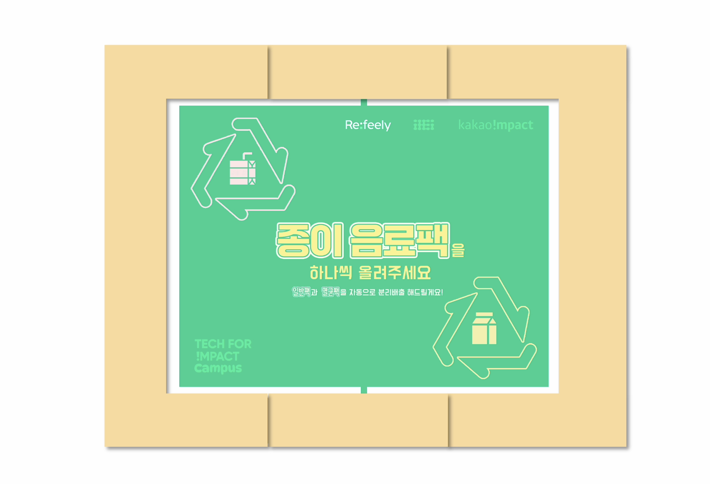

# PackSwing
### 탈부착형 종이팩 자동 분리수거 모듈 (Detachable Automated Sorting Module for Paper Cartons)

 탈부착형 종이팩 자동 분리수거 모듈(이하 PackSwing)은 뚜껑 형식의 모듈로 다양한 쓰레기통에 범용적으로 적용하여 일반팩과 멸균팩을 자동으로 분리해주는 모듈입니다. 본 프로토타입에서는 전문 센서 등을 사용하기보다는 BreadBoard와 아두이노, 그리고 시중에 판매되는 보편화된 금속 센서를 활용하여 대략적으로 기능을 확인할 수 있는 정도로 제작해보았습니다. 

💡  **PackSwing**은 일반팩과 멸균팩을 구분하는 차이점인 알루미늄 막의 존재 유무를 활용하여 일반팩과 멸균팩을 자동으로 분리해줍니다. 이러한 로직을 구현하는 아두이노 코드가 하단에 제공되어있습니다.

The Detachable Paper Carton Automatic Sorting Module (hereafter referred to as PackSwing) is a module designed to be universally compatible with various trash bins, automatically sorting between regular paper cartons and aseptic cartons. In this prototype, instead of using specialized sensors, we utilized a breadboard, an Arduino, and commonly available metal sensors to build a simplified version that demonstrates the basic functionality.

💡 **PackSwing** automatically sorts regular and aseptic cartons by detecting the presence or absence of an aluminum layer—a key distinguishing feature between the two types. The Arduino code implementing this logic is provided below.




## 프로젝트 개요 (Project Overview)

- **목적(Purpose)**
    - 이 솔루션은 **멸균팩과 일반팩을 자동으로 분리할 수 있는 기능**을 제공합니다.
    - 기존의 일반 종이류 쓰레기통에서 무작위적으로 버려지고 있는 **멸균팩과 일반팩, 종이의 혼합배출**을 해결하여 종이팩의 재활용률을 높일 수 있습니다.
    - 기존의 IoT 수거함은 AI 딥러닝을 활용하여 사용하는 전력이 많고 크기가 크다는 문제점이 있었는데, 분류 알고리즘을 간단히 하여 **사용전력과 크기를 모두 줄여** 환경적인 측면에서도, 범용성에도 큰 장점이 있습니다.
    - This solution provides the ability to automatically separate aseptic and regular paper cartons.
    - It addresses the issue of **mixed disposal of aseptic cartons, regular cartons, and paper** in conventional paper recycling bins, thereby improving the overall recycling rate of paper cartons.
    - While conventional IoT-based collection systems often rely on AI deep learning, which requires high power consumption and large physical size, PackSwing simplifies the classification algorithm to significantly **reduce both power usage and device size**, making it more environmentally friendly and widely applicable.

- **주요 기능(Key Features)**
    1. **방 생성 및 참여**: 사용자는 방을 생성하고, 방 코드로 다른 팀원들이 참여할 수 있습니다.
    2. **가방 선택**: 각 팀은 생존 가방을 선택하고, 필요한 아이템을 추가할 수 있습니다.
    3. **시뮬레이션:** 선택한 아이템을 기반으로 시뮬레이션을 진행하여 생존 전략을 테스트합니다.
    4. **결과 확인**: 시뮬레이션 결과를 확인하고, 각 팀의 상태를 모니터링할 수 있습니다.

    <ol start="1">
    <li><b>Room Creation and Participation</b>: 
    Users can create a room and invite team members via a code.
    </li><li><b>Bag Selection</b>: 
    Each team selects a survival bag and adds necessary items.
    </li><li><b>Simulation</b>: 
    Run simulations based on chosen items to test survival strategies.
    </li><li><b>Results</b>: 
    View simulation results and monitor each team’s status.</li>
    </li>
    </ol>
    
- **아두이노 코드(Arduino Code)**
[Arduino Code](./ArduinoCode.ino)

- **회로도(Circuit Diagram)**

  
    
## 프로젝트 결과 (Project Outcomes)

### 데모 영상 (Demo Video)
[Demo Video Link](./assets/DemoVideo.mp4)

  **View raw (Sorry about that, but we can’t show files that are this big right now.)** 와 같은 텍스트가 뜰 수 있지만, **View raw** 를 클릭하면 영상을 다운받을 수 있습니다.
  
  You may see a message like **View raw (Sorry about that, but we can’t show files that are this big right now.)**, but you can still download the video by clicking **View raw**.

### 특징 및 장점 (Features & Benefits)
- **실시간 피드백 및 상호작용:**  
    교육자와 학습자 간 실시간 피드백과 상호작용을 통해 학습 흥미를 유발하고 기억에 오래 남는 경험을 제공합니다.
- **몰입형 학습:**  
    다양한 시나리오와 게임 메커니즘을 활용하여 재미와 학습을 조화롭게 결합한 참여형 교육을 제공합니다.
- **효과적인 교육 전달:**  
    단방향 강의를 넘어선 상호작용 방식으로 기존 방재 교육의 한계를 극복하고, 더 높은 학습 효과를 보장합니다.
- **교육 확산성:**  
    온라인 게임 형태로 시공간의 제약 없이 누구나 쉽게 접근 가능하며, 방재 교육 자료로 활용할 수 있어 교육 전파에 기여합니다.
- **Real-Time Feedback and Interaction:**  
    Facilitates real-time feedback and interaction between educators and learners, enhancing engagement and creating a lasting learning experience.
- **Immersive Learning:**  
    Offers interactive education by combining engaging scenarios with game mechanics, balancing fun and learning effectively.
- **Effective Knowledge Delivery:**  
    Overcomes the limitations of traditional disaster education through participatory methods, ensuring greater learning impact.
- **Scalable Education:**  
    Provides disaster education without time or space constraints through online games, enabling easy access and contributing to the dissemination of educational resources.

## 기대 효과 (Expected Benefits)


### 영향 (Impact)

- **교육 참여율 및 만족도 증가**
- **재난 교육의 효과 증가**: 쉽게 흥미를 느낄 수 있는 게임으로 교육 내용을 효과적으로 전달합니다.
- **온라인 재난 교육 콘텐츠 증가**: 제작된 플랫폼에 높은 품질의 온라인 재난 교육 콘텐츠를 개제할 수 있습니다.

- **Increased participation and satisfaction in education**
- **Increased effectiveness of disaster training**: Effectively delivers educational content through games that are easy to engage with.
- **Increased online disaster education content**: High-quality online disaster education content can be published on the developed platform.

### 확장 가능성 (Scalability)

- **다양한 시나리오 업데이트**
    전 세계의 다양한 재난 상황을 기반으로 새로운 시나리오를 지속적으로 추가하여 교육 효과를 극대화할 수 있습니다.
- **Multiplayer Mode**
    A mode where multiple players collaborate to pack survival bags and create survival plans in disaster scenarios.


## 설치 및 실행 방법 (Installation & Execution)

### Service is now deployed and hosted on https://disaster.buttercrab.net/
If you want to run the program in your local environment, follow the instruction.

**1. Check if the Docker Daemon is running**
If the Docker Daemon is not installed, please download it from 🖥️[Download Docker](https://docs.docker.com/engine/install/).

**2. Clone the Repository**
   ```bash
   git clone https://github.com/ijake-16/disaster.io.git
   ```
**3. Move to the project directory**
   ```bash
   cd disaster.io
   ```
**4. Run the App with Docker**
   ```bash
   docker compose up --build # for mac/linux
   ```
   ```powershell
   docker-compose up --build # for windows
   ```
**5. Go to the Start Page**
    link: [https://localhost:8080/](https://localhost:8080/)

## 팀 소개 (Team Introduction)

### 팀원 (Team Members)
- **김정빈 (Jeongbin Kim)**: PM, 기획자, 개발자 (PM, Planner, Developer)  
  ✉️ Mail: jake16@kaist.ac.kr | GitHub: [ijake-16](https://github.com/ijake-16)
- **윤지훈 (Jihoon Youn)**: 기획자, 개발자 (Planner, Lead Developer)  
  ✉️ Mail: jihoon9835@gmail.com | GitHub: [younjihoon](https://github.com/younjihoon)
- **김지민 (Jimin Kim)**: 기획자, 개발자 (Planner, Developer)  
  ✉️ Mail: kjm10122@gmail.com | GitHub: [VVictorVV](https://github.com/VVictorVV)
- **이재현 (Jaehyeon Lee)**: 개발자 (Developer)  
  ✉️ Mail: jh5323565@kaist.ac.kr | GitHub: [jaedungg](https://github.com/jaedungg)
- **임자영 (Jayeong Im)**: 디자이너, 기획자 (Designer, Planner)  
  ✉️ Mail: bagjay@kaist.ac.kr | GitHub: [Gomchiiii](https://github.com/Gomchiiii)
- **황보민석 (Minseok Hwangbo)**: 개발자 (Developer)  
  ✉️ Mail: ecobrick@kaist.ac.kr | GitHub: [hwangbominseok](https://github.com/hwangbominseok)

### 펠로우 및 멘토 (Fellow & Mentor)
- **Fellow : 더프라미스 김동훈 펠로우님** (Donghoon Kim @ The Promise): [Organization Website](https://www.thepromise.or.kr/)
- **Mentor : 카카오페이 이상은 멘토님** (Sangeun Lee @ Kakaopay): 멘토 연락처 또는 링크


## 개발 환경 (Development Environment)

### Frontend
- **Language:** JavaScript
- **Framework:** SolidJS

### Backend
- **Language:** Python
- **Framework:** FastAPI

### Other Tools
- Axios, Ky(HTTP Client), XLSX(Data)

### 버전 관리
- **Git branch 사용:** PR 기반의 프로세스를 적용. Notion을 통해 이슈 확인 및 프로젝트 버전 관리.
- **Git Branching:** A pull request-based workflow.
- **Issue Management:** Managed via Notion, with GitHub for specific issues.
### 협업 및 커뮤니케이션
- **일정 관리:** Notion에서 Kanban과 Calender 위젯으로 일정 관리. Todo Page를 만들어 작업 분배 및 진행 현황 확인.
- **이슈 관리:** Notion을 바탕으로 GitHub 이슈 작성 및 관리.
- **Schedule Management:** Use Notion’s Kanban boards and calendar widgets for task tracking and scheduling.
- **Issue Management:** Draft and manage GitHub issues through Notion.
- 🛠️  [Notion page link](https://www.notion.so/7f309ba38db1464aa59cc1dd7ab897d7?pvs=21)


## 연관 자료 (Related Resources)
- [최종 발표 자료 링크 (Final Presentation Materials)](https://www.figma.com/slides/Hwml6sUaOU8AFqtlaMGxHO/%5B13%EC%A3%BC%EC%B0%A8%5D-Final-Presentation?node-id=1-540&t=zUOB05o0XEOy3HZw-1)
- [참조 자료 (References)](#)
- [펠로우 조직 사이트 (Fellow Organization Website)](https://www.thepromise.or.kr/)
